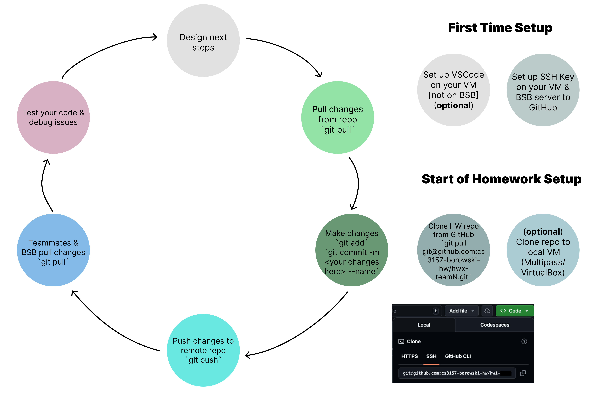
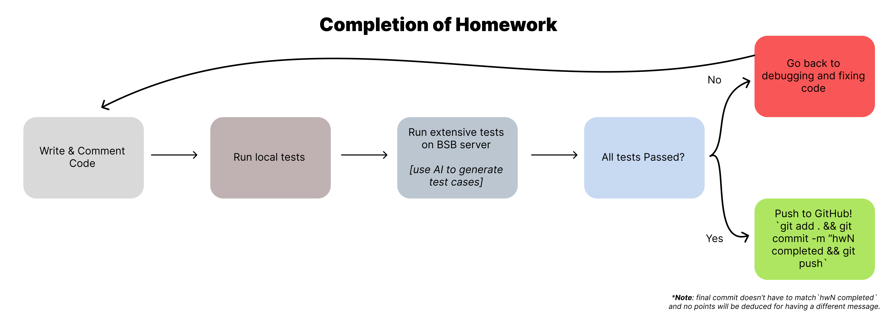

# Homework Workflow Guide

This guide walks you through setup, development, and submission for homework assignments in COMS 3157 Advanced Programming.

> ⚠️ **Critical:** Your submission is your last Git commit before the deadline. Code that exists only on your local machine or the BSB server will **not** be graded.

## Overview



## First-Time Setup

Before starting your first homework, complete these one-time setup steps:

### 1. Set Up SSH Keys for GitHub

You need SSH keys configured on both the BSB server and your local VM (if using one) to push/pull from GitHub without entering your password every time.

```bash
# On BSB server (and optionally your local VM)
ssh-keygen -t ed25519 -C "your_email@columbia.edu"
cat ~/.ssh/id_ed25519.pub
```

Copy the output and add it to your GitHub account under **Settings → SSH and GPG Keys → New SSH Key**.

For detailed instructions, see the [SSH Guide](ssh.md).

### 2. (Optional) Set Up a Local Development Environment

While all work can be done directly on the BSB server, some students prefer a local environment for editing code:

- **Mac users:** Use [Multipass with VSCode](multipass_vscode.md)
- **Windows users:** Use VirtualBox with Ubuntu

> Note: VSCode cannot be run on the BSB server due to resource constraints.

## Starting Each Homework

### 1. Clone the Homework Repository

```bash
# On BSB server
git clone git@github.com:cs3157-borowski-hw/hwX-teamN.git
cd hwX-teamN
```

Replace `X` with the homework number and `N` with your team number.

### 2. (Optional) Clone to Your Local VM

If you're using Multipass or VirtualBox for local development:

```bash
# On your local VM
git clone git@github.com:cs3157-borowski-hw/hwX-teamN.git
```

## Development Cycle

Follow this cycle as you work on your homework:

### Pull → Code → Commit → Push → Test

**1. Pull latest changes** (especially important for team projects):

```bash
git pull
```

**2. Make your changes**, then stage and commit:

```bash
git add <files>
git commit -m "Descriptive message of your changes" --author="Your Name <your_email>"
```

**3. Push to GitHub:**

```bash
git push
```

**4. Test your code** on the BSB server and debug any issues.

**5. Design next steps** and repeat the cycle.

> 💡 **Tip:** Commit frequently with meaningful messages. This creates a clear history and makes it easier to identify when bugs were introduced.

## Completing Your Homework



Before submitting, follow this checklist:

### 1. Clean Up Your Code

- Remove debug print statements
- Add comments explaining complex logic
- Ensure consistent formatting

### 2. Run Local Tests

Test your code thoroughly on the BSB server:

```bash
ssh UNI@bsb.cs.columbia.edu
cd hwX-teamN
make        # or gcc commands as specified
./your_program [test inputs]
```

### 3. Run Extensive Tests

Use an LLM (ChatGPT, Claude, Gemini) to help generate comprehensive test cases, including edge cases. Test thoroughly on the BSB server—this is where your code will be graded.

### 4. All Tests Passed?

- **No:** Go back to debugging and fixing your code. Repeat until all tests pass.
- **Yes:** Proceed to final submission.

### 5. Push Your Final Submission

```bash
git add .
git commit -m "hwX completed"
git push
```

> **Note:** The commit message doesn't have to be "hwX completed"—any descriptive message is fine.

## Quick Reference

| Task                | Command                                                     |
| ------------------- | ----------------------------------------------------------- |
| SSH into BSB server | `ssh UNI@bsb.cs.columbia.edu`                               |
| Clone homework repo | `git clone git@github.com:cs3157-borowski-hw/hwX-teamN.git` |
| Pull latest changes | `git pull`                                                  |
| Stage changes       | `git add <files>` or `git add .`                            |
| Commit changes      | `git commit -m "message" --author="Name <email>"`           |
| Push to GitHub      | `git push`                                                  |
| Check repo status   | `git status`                                                |
| View commit history | `git log --oneline`                                         |

## Server Information

- **Server URL:** `bsb.cs.columbia.edu`
- **Username:** Your Columbia UNI
- **Operating System:** Ubuntu 24.04.03 (Google Compute Engine)
- **Login command:** `ssh UNI@bsb.cs.columbia.edu`

## Related Guides

- [Login Guide](login.md) – Introduction to the BSB server
- [SSH Guide](ssh.md) – Setting up SSH keys
- [Git Guide](git.md) – Git fundamentals
- [VSCode on Multipass](multipass_vscode.md) – Local development setup for Mac
- [Submission Clarifications](submission.md) – Confirming your submissions
- [Valgrind Guide](valgrind.md) – Memory debugging

---

_Remember: Only code pushed to GitHub before the deadline will be graded. When in doubt, push your work!_

### Acknowledgements

This guide was written by Amit Aharoni, January 2026
